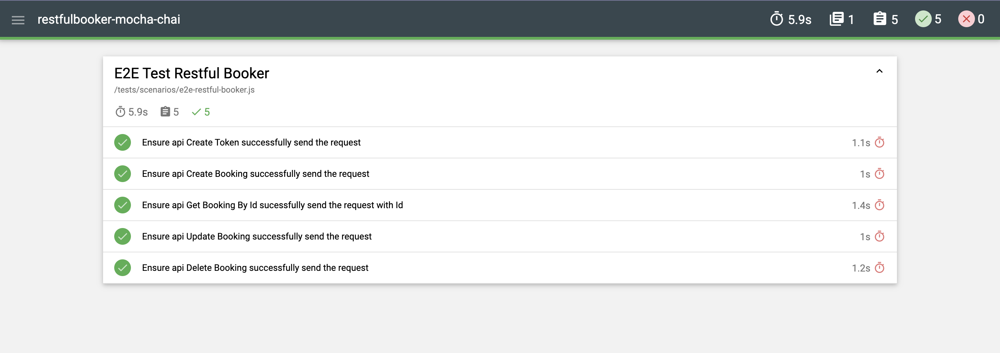
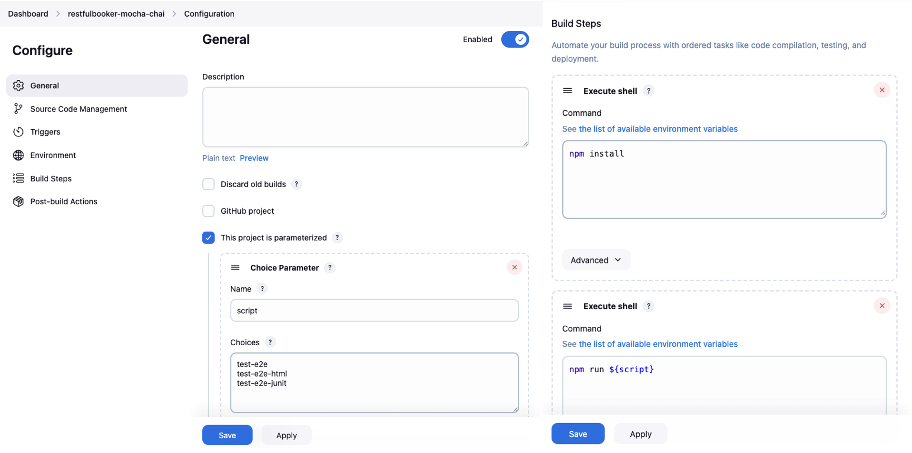
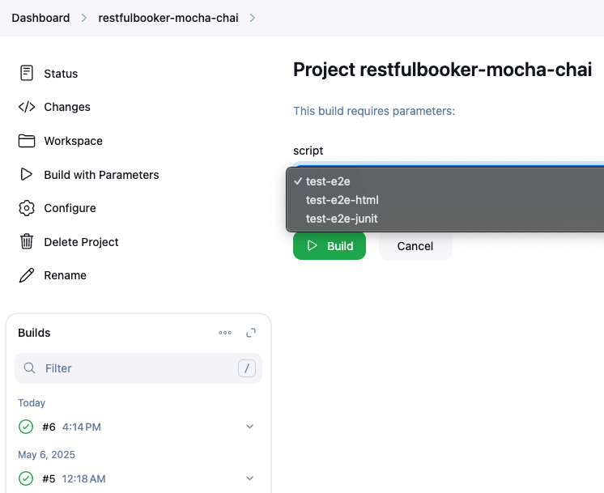
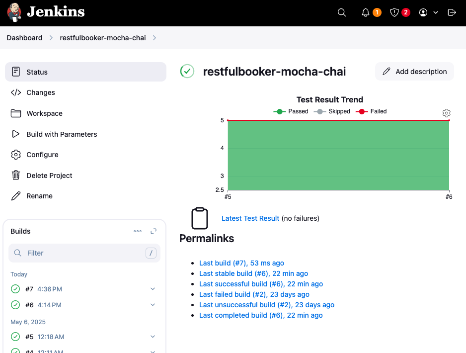
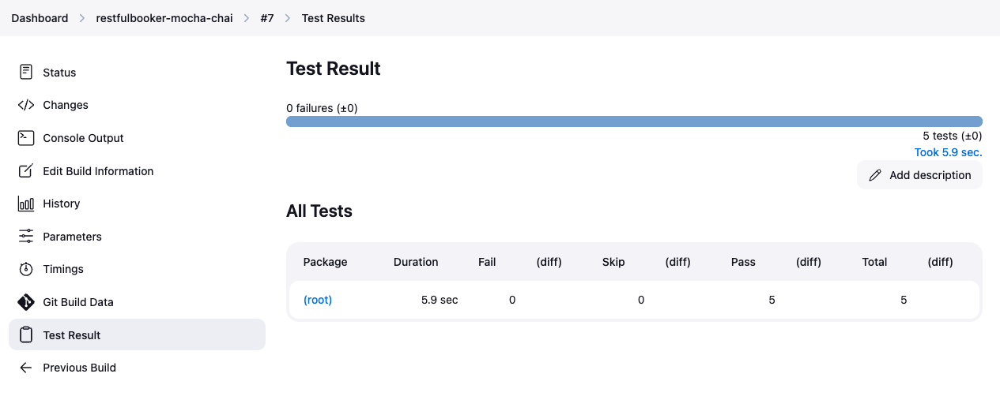

# restfulbooker-mocha-chai

[](https://skillicons.dev)

This repository contains a simple API automation project for [restful-booker](https://restful-booker.herokuapp.com/apidoc/index.html#api-Booking-GetBookings), built using the Page Object Model (POM) design pattern. Generates test reports with Mochawesome Reporter, and integrates with Jenkins CI/CD for automated job execution.

## Prerequisites

- **Node.js** and **npm** must be installed on your machine.

## How to run

Install project dependencies by running the following command in your terminal:

```sh
npm install
```

## Sample Reports using Mochawesome



## Run in Jenkins

- This is a simple configuration job in jenkins

  

- Build with parameters

  

- Result

  
  
